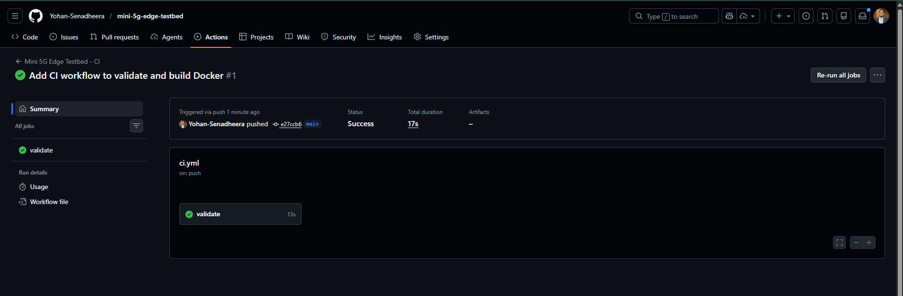

# Mini 5G Edge Testbed (Cloud-Native Networking Lab)

A **5G-inspired, cloud-native edge networking testbed** focused on how modern 5G systems are **designed, deployed, automated, and monitored** — rather than radio/PHY implementation.

This project demonstrates **containerized network-function style components**, **edge-style deployment**, **automation readiness**, and **real-time observability** using industry-standard tools.

---

## What “5G” means in this project (Scope & Honesty)

This is **not a radio-level 5G implementation** (no gNB, spectrum, or PHY/MAC layers).

Instead, the project focuses on **core 5G architectural principles**, including:
- **Network Functions (NFs)** as independent, containerized components
- **Edge computing mindset (MEC-style)** — services deployed close to users
- **Cloud-native design** (containers, orchestration, automation)
- **Strong observability and monitoring**, which is critical in real 5G networks

This mirrors how real 5G cores (e.g., Open5GS, Free5GC) are built and operated.

---

## High-Level Architecture (Phase 1)

📄 **Detailed architecture:**  
See the full architecture description and diagram here:  
➡️ [`docs/architecture.md`](docs/architecture.md)

---

## Current Implementation (Completed)

✅ Containerized “network function” components  
✅ Edge-style deployment on a Linux node  
✅ Continuous traffic generation  
✅ Real-time monitoring dashboard (CPU, memory, container behavior)  
✅ Prometheus targets verified and Grafana dashboards visualized  

---

## Monitoring Dashboard

The dashboard provides:
- **Edge node health** (CPU, memory)
- **Container-level resource usage** (CPU & memory)
- Visibility into workload behavior under traffic

This reflects real operational monitoring used in cloud-native 5G deployments.

---

## Automation & CI/CD (Current Status)

- One-command deployment using Docker Compose
- Repository structured to support CI/CD pipelines
- Basic CI pipeline implemented using GitHub Actions  (compose validation & build)

### CI Pipeline Status

The project includes a basic **GitHub Actions CI pipeline** that validates the Docker Compose configuration and builds containers on each push.

---

## Roadmap: Kubernetes & AWS (Planned / Ongoing)

### Phase 2 — Kubernetes Migration
- Migrate containerized components to **Kubernetes (k3s / kind)**
- Deploy network functions as Kubernetes Pods
- Replace cgroup-based metrics with pod/container labels
- Apply basic self-healing (restart policies)

### Phase 3 — Cloud Deployment (AWS)
- Deploy stack on **AWS EC2**
- Use **ECR** for container images
- Optional migration to **EKS**
- Secure networking via VPC & Security Groups

### Phase 4 — Extended 5G Integration (Optional)
- Integrate Open5GS / Free5GC components
- Simulate UE traffic using UERANSIM
- Study user-plane behavior at the edge

---

## Tech Stack

Docker, Linux (WSL2 Ubuntu), Prometheus, Grafana, cAdvisor, Node Exporter  
(Kubernetes & AWS planned)

---
## Repository Structure (Key Files)

- `docker-compose.yml` — Edge testbed services
- `docs/architecture.md` — Detailed architecture explanation
- `images/architecture.png` — Architecture diagram
- `.github/workflows/ci.yml` — CI pipeline (GitHub Actions)

---
## Project Status

🚧 **Ongoing** — foundation completed, orchestration and cloud phases in progress.
